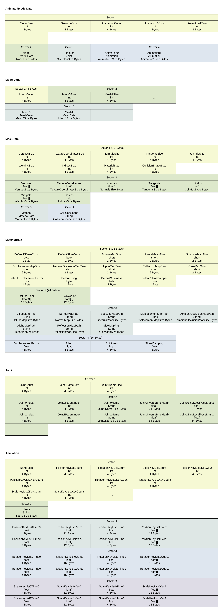

# File format specification

ModelData files are stored as bytes. Here is the specification of the format. 

## Fundamental Data types

#### Float
Size: 4 bytes  
Big Endian

#### Short
Size: 2 bytes  
Big Endian

#### Int
Size: 4 bytes  
Big Endian

#### String
Size: x bytes  
Alias: char[]  
Big Endian

#### Char/Byte
Size: 1 byte  
Sometimes a byte is used as boolean, then 0 is false and all greater than 0 is true.

## Graphic illustration

## AnimatedModelData

#### First Sector [MetaData]
ModelSize (int) | SkeletonSize (int) | AnimationCount (int) | Animation0Size (int) | Animation1Size (int) | ...

#### Second Sector [ModelData]
Model (ModelData)

#### Third Sector [Skeleton]
Skeleton (Skeleton)

#### Fourth Sector [Animations]
Animation0 (Animation) | Animation1 (Animation) | ...

## ModelData

#### First Sector [MetaData]
MeshCount (int) | Mesh0Size (int) | Mesh1Size (int) | ...

#### Second Sector [MeshData]
Mesh0 (MeshData) | Mesh1 (MeshData) | ...

## MeshData

#### First Sector [MetaData]
VerticesSize (int) | TextureCoordinatesSize (int) | NormalsSize (int) | TangentsSize (int) | JointIdsSize (int) | WeightsSize (int) | IndicesSize (int) | MaterialSize (int) | CollisionShapeSize (int)

#### Second Sector [MeshData]
Vertices (float[]) | TextureCoordinates (float[]) | Normals (float[]) | Tangents (float[]) | JointIds (int[]) | Weights (float[]) | Indices (int[])

#### Third Sector [Material]
Material (MaterialData)

#### Fourth Sector [CollisionShape]
CollisionShape (String)

## MaterialData

#### First Sector [MetaData]
DefaultDiffuseColor (byte) | DefaultGlowColor (byte) | DiffuseMap size in bytes (short) | NormalMap size in bytes (short) | SpecularMap size in bytes (short) | DisplacementMap size in bytes (short) | AmbientOcclusionMap size in bytes (short) | AlphaMap size in bytes (short) | ReflectionMap size in bytes (short) | GlowMap size in bytes (short) | DefaultDisplacementFactor (byte) | DefaultTiling (byte) | DefaultShininess (byte) | DefaultShineDamping (byte)

#### Second Sector [Colors]
DiffuseColor (3 floats) | GlowColor (3 floats)

#### Third Sector [Textures]
DiffuseMapPath (String) | NormalMapPath (String) | SpecularMapPath (String) | DisplacementMapPath (String) | AmbientOcclusionMapPath (String) | AlphaMapPath (String) | ReflectionMapPath (String) | GlowMapPath (String)

#### Fourth Sector [Floats]
DisplacementFactor (float) | Tiling (float) | Shininess (float) | ShineDamping (float)

## JointIds

#### First Sector [MetaData]
JointCount (int) | Joint0Size (int) | Joint1Size (int) | ...

#### Second Sector [JointData]
Joint0Index (int) | Joint0ParentIndex (int) | Joint0Name (String) | Joint0InverseBindMatrix (float[]) | Joint0BindLocalPoseMatrix (float[]) | Joint1Index (int) | ...

## Animation

#### First Sector [MetaData]
NameSize (int) | PositionKeyListCount (int) | RotationKeyListCount (int) | ScaleKeyListCount (int) | PositionKeyList0KeyCount (int) | PositionKeyList1KeyCount (int) | ... | RotationKeyList0KeyCount (int) | RotationKeyList1KeyCount (int) | ... | ScaleKeyList0KeyCount (int) | ScaleKeyList1KeyCount (int) | ...

#### Second Sector [PositionKeys]
Name (String)

#### Third Sector [PositionKeys]
PositionKeyList0Time0 (float) | PositionKeyList0Vec0 (float[]) | PositionKeyList0Time1 (float) | PositionKeyList0Vec1 (float[]) | ... | PositionKeyList1Time0 (float) | PositionKeyList1Vec0 (float[]) | PositionKeyList1Time1 (float) | PositionKeyList1Vec1 (float[]) | ...

#### Fourth Sector [RotationKeys]
RotationKeyList0Time0 (float) | RotationKeyList0Vec0 (float[]) | RotationKeyList0Time1 (float) | RotationKeyList0Vec1 (float[]) | ... | RotationKeyList1Time0 (float) | RotationKeyList1Vec0 (float[]) | RotationKeyList1Time1 (float) | RotationKeyList1Vec1 (float[]) | ...

#### Fifth Sector [ScaleKeys]
ScaleKeyList0Time0 (float) | ScaleKeyList0Vec0 (float[]) | ScaleKeyList0Time1 (float) | ScaleKeyList0Vec1 (float[]) | ... | ScaleKeyList1Time0 (float) | ScaleKeyList1Vec0 (float[]) | ScaleKeyList1Time1 (float) | ScaleKeyList1Vec1 (float[]) | ...