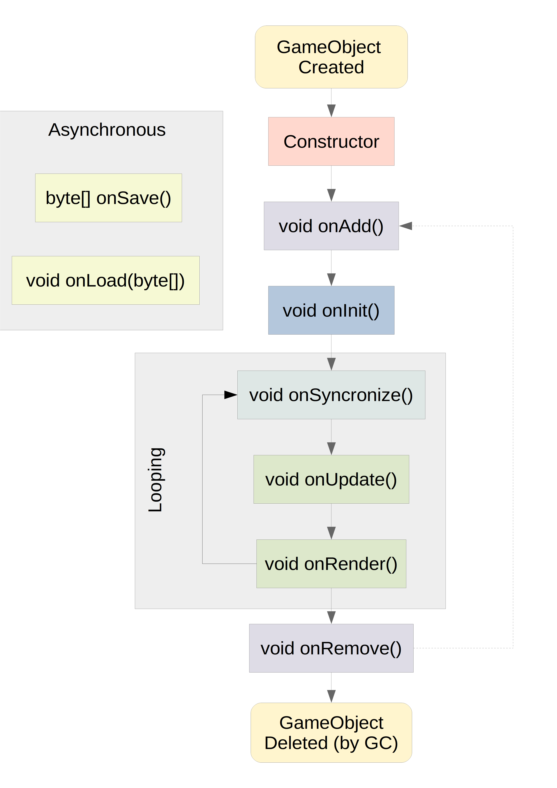

# GameObjects Lifecycle

This Page shortly describes the life cycle of a GameObject. Make sure to never remove the super method call, to don't interrupt the lifecycle in the hierachy.

## Graphic illustration

## Methods

#### void onAdd();

This method gets called once, when the GameObject is added to a scene, or to another GameObject as child. If the GameObject gets removed and readded, the method will be called again.

#### void onRemove();

This method gets called once, when the GameObject gets removed from a scene or its parent GameObject (if it had one). If the GameObject gets added and removed again, the method will be called again.

#### void onInit();

This method gets called once in the GameObject life cycle. Even if the GameObject gets removed and readded, this method dont gets called again. Its like an additional constructor, except that its not gets called when the GameObject gets created, but when its first has to action.

#### void onUpdate();

This method gets called every frame before the render method. Here is place for the GameObject logic updates, e.g. input handling, physics, actions, ...

#### void onRender();

In this method the GameObject gets rendered onto the screen (if it has an graphical representation). Its primary used for MasterRenderer calls.

#### void onSyncronize();

This method gets called, every time a network update occurs. Here the GameObject has to syncronize all used network variables, like SyncFloats, SimpleEvents, ChatEvents, SyncMatrices, ...

#### byte[] onSave();

This method gets called asynchronous, when the game wants the GameObject to save its current state. If you have to save your current state, convert the relevant data into bytes and return them in this method.

#### void onLoad(byte[]);

This method gets called asynchronous, when the game wants to GameObject to recreate its state from saved data. This method passing a byte array, which contains the data, the GameObject saved/returned with the onSave method.
